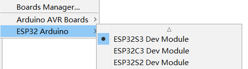

# Arduino Getting Started

[简体中文](readme_zh.md)

## Board selection and configuration

Recommended board selection:

Recommended board configuration:

The BPI-Leaf-S3 development board provides a native USB interface that is directly connected to the chip, so it is recommended to configure the USB related settings directly according to the above figure, without the need for an external UART serial port conversion chip.

To enable your BPI-Leaf-S3 device to flash via USB-CDC.

There are two ways to enter Bootloader mode:

1.Connect it to the computer via USB, hold BOOT button, press RST button once, then release BOOT button.

2.Hold BOOT button while disconnected to power, connect to PC via USB, then release BOOT button.

The chip controls GPIO0 via BOOT button to choose between reset or cold boot.

Confirm the port of your BPI-Leaf-S3 device via device manager, it might display different port if you are on different modes.

## Examples

Open the routines in this repository through the Arduino IDE to use, click **Verify/Compile** , wait for the completion of compilation, and click **Upload** to download the program to the development board.

In addition to some of the examples provided in this repository, you can also use the examples in **File→Examples**.