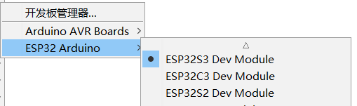
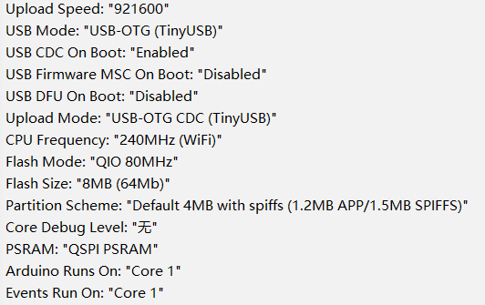

# Arduino快速上手

[English](readme.md)

## 板型选择及配置

推荐板型：

推荐配置：

BPI-Leaf-S3 开发板提供芯片直连的原生USB接口，所以推荐直接按照上图配置USB相关设置，无需外接UART串口转换芯片。

为了使你的BPI-Leaf-S3开发板可以通过USB-CDC刷写FLASH，需要设置开发板为固件下载模式。

有两种操作方法：

1.通过USB连接到电脑，按住BOOT键，再按一下RESET键并松开，最后松开BOOT键。

2.在断开供电的条件下按住BOOT键，再通过USB连接到电脑，最后松开BOOT键。

需要在设备管理器中确认接口，固件下载模式与普通模式下的接口序号可能是不一样的。

## 例程

将本仓库的例程通过Arduino IDE打开即可使用，单击 **验证/编译** ，等待编译结束后单击**上传**即可将程序下载进开发板。

除了本仓库提供的一些例程，你还可以使用 **文件→示例** 中的例程。